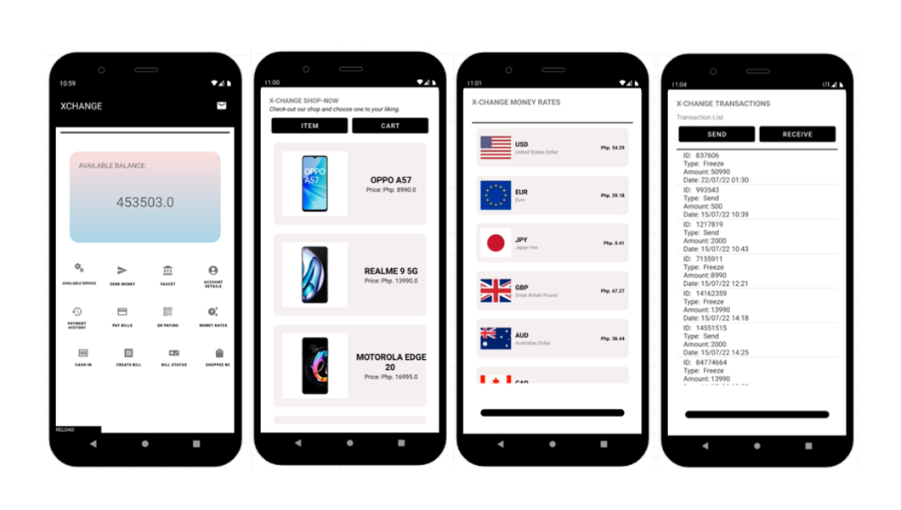

  
  
Xchange is a mobile wallet app project that mimics how exchanges work. It uses Firebase as its database and allows users to send and receive demo money for testing purposes.

  
  
Xchange also includes a simple market where users can "purchase" phones, and features its own payment system, allowing users to pay their bills using demo money. With Firebase's secure and reliable database system, Xchange offers a safe and convenient way for users to test out various financial scenarios on the go. Its user-friendly interface and advanced features make it the perfect solution for those looking for a modern and efficient way to simulate different financial transactions.

